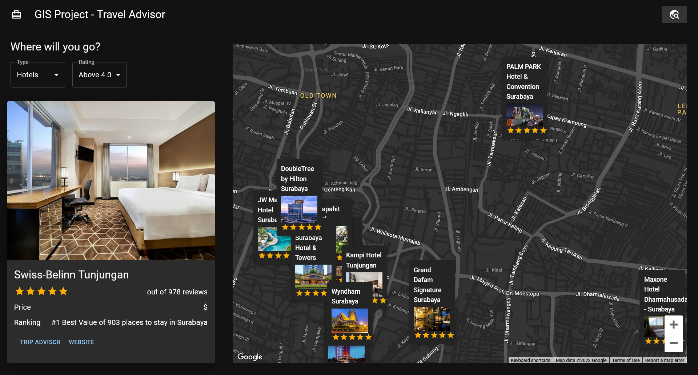

# [GIS] Travel Advisor

A single-page [application](https://jag-gismap.netlify.app/) with map services enabled.


## Features

- Show current location and travel destinations
- Live preview of the intractable map 
- Display destination cards on the map to indicate where it is located 
- Filter places based on type or rating
- Search for desired locations using an autocomplete search bar


## Screen Captures




## Environment Variables

To run this project, you will need to supply your own keys for the following environment variables in your .env file.

`REACT_APP_GOOGLE_MAPS_API_KEY`

`REACT_APP_RAPID_API_KEY`


## Run Locally

Clone the project

```bash
  git clone https://github.com/jasandgun/gis-travel-advisor
```

Go to the project directory

```bash
  cd gis-travel-advisor
```

Install dependencies

```bash
  npm install
```

Start the app in the development mode on [http://localhost:3000](http://localhost:3000)

```bash
  npm start
```

The page will reload if you make edits. You will also see any lint errors in the console.


## Documentation
Made with [React](https://reactjs.org/) and [TypeScript](https://www.typescriptlang.org/), bootstrapped with [Create React App](https://create-react-app.dev/docs/getting-started/).\
APIs used in this project:
- [Google Maps - JavaScript API](https://developers.google.com/maps/documentation/javascript/overview)
- [Google Maps - Places API](https://developers.google.com/maps/documentation/places/web-service/overview)
- [RapidAPI - Travel Advisor by Api Dojo](https://rapidapi.com/apidojo/api/travel-advisor)


## Acknowledgements

 - [tutorial by JavaScript Mastery](https://www.youtube.com/watch?v=UKdQjQX1Pko)